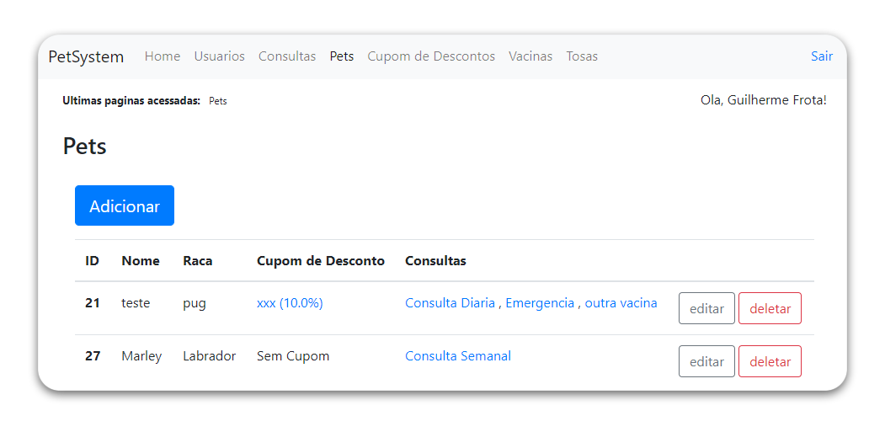

spring-boot-crud
==

## Simple crud application using the following technologies
  - IntelliJ - IDE
  - Spring Boot - Framework
  - Hibernate / Jpa - ORM
  - H2 - Database
  - JSP (JSTL) - Templating
  
## Implemented Features
  - Authentication(http-session and Spring filters)
  - 6 different CRUDs
  - CRUD abstration to reduce boilerplate
  
 
## Rewrites of this project using different technologies
 - [SPA in js with no dependencies using Web Components](https://github.com/guiquintelas/pet-system-js)
 - [Vue + Typescript + Vuetify + Vuex](https://github.com/guiquintelas/pet-system-vue)